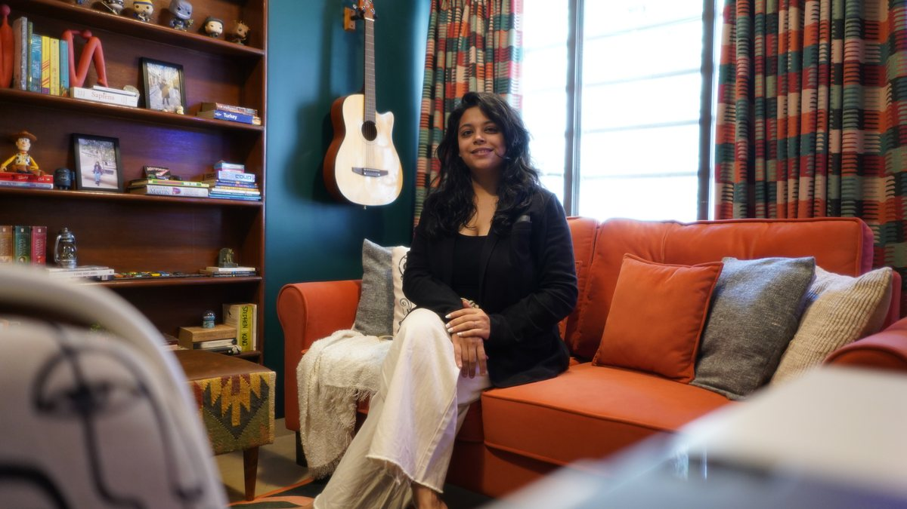

# Elements — Shivani Shilotri

The portfolio website for **Shivani Shilotri** — architect turned **Production Designer**
& **Interior Stylist**, working under the studio name **Elements**.

One site, two practices. A shared toggle lets visitors switch between the
**Production Design** world and the **Interior Design** world, and every view has a
**one‑click shareable link** so Shivani can send someone *only* her production work or
*only* her interiors.

It's a fast, dependency‑free static site (plain HTML/CSS/JS) — ideal for Vercel, and
easy to hand‑edit.

---

## Quick start (run locally)

No build step. Just serve the folder:

```bash
# from the project root
python3 -m http.server 8000
# then open http://localhost:8000
```

(or use any static server / the VS Code “Live Server” extension).

---

## Deploy to Vercel

1. Push this repo to GitHub (already set up on branch `claude/keen-lovelace-wk1ol8`).
2. On [vercel.com](https://vercel.com) → **Add New Project** → import this repo.
3. Framework preset: **Other**. Build command: *(leave empty)*. Output directory: `./`.
4. Deploy. `vercel.json` already sets clean URLs and long‑cache headers for `/assets`.

Later, add a custom domain in Vercel → **Settings → Domains**.

---

## The two‑practice model (how the toggle & sharing work)

- The **Production ⟷ Interiors** toggle (in the header and the hero) swaps the active
  “world”. It re‑themes the accent colour (sage for production, dusty‑rose for
  interiors), swaps the hero/section copy, and shows the matching projects.
- The state lives in the URL so it's shareable:
  - `/?work=production` → opens on the production world
  - `/?work=interior` → opens on the interior world
  - `/` → defaults to production (her lead discipline)
- The **Contact → “Share a portfolio”** buttons copy those deep links to the clipboard
  with one click (production‑only, interior‑only, or the full site).

---

## Adding real images

Everything is wired so photos “just work” when you drop them in. Until then, tasteful
pastel placeholders (with each project's name) stand in — nothing looks broken.

### Project tiles
Open **`assets/js/data.js`**. Each project is an object. To add a real cover photo, set
its `image` field:

```js
{ title: "4 BHK Home Makeover", brand: "Chembur, Mumbai",
  image: "assets/img/work/chembur-living.jpg",   // ← add this
  ... }
```

Put the file in `assets/img/work/`. Landscape, ~1600×1000px, JPG/WebP is ideal.

### Video thumbnails
Production films that have a **YouTube** link already show the real YouTube thumbnail
automatically and open the film in a lightbox when clicked — no work needed once live.
**Vimeo / Instagram** films use a styled placeholder (their thumbnails can't be
hot‑linked); to give them a real still, set the tile's `image` field as above.

### Portrait (About section)
In **`index.html`**, find the `<!-- Drop a real portrait here -->` note inside the
`.portrait` block and replace the placeholder `<div class="ph">…</div>` with:

```html

```

### Social share preview
Add `assets/img/og.jpg` (1200×630) and point the two `og:image` / `apple-touch-icon`
tags in `index.html`'s `<head>` at it, for rich link previews on WhatsApp/iMessage.

---

## The logo

The circular **Elements** badge is recreated as a crisp, scalable SVG so it renders
perfectly at any size and matches the studio fonts. It appears:

- inline in the hero and footer (`index.html`),
- as a standalone file at **`assets/img/logo.svg`**,
- as the favicon at `assets/img/favicon.svg`.

If you have the **original logo file**, drop it in as `assets/img/logo.png` (or `.svg`)
and it can replace the recreation — the recreation is pixel‑close in the meantime.

---

## Design system

Carried from Shivani's portfolio PDF and its stated brand language.

**Palette** (`assets/css/styles.css`, `:root`)

| Token | Hex | Use |
|---|---|---|
| Warm White | `#FFFCF7` | page background |
| Warm Ivory | `#FFF5E3` | tint panels |
| Muted Sage | `#AEBBA8` / `#7E9078` | production accent |
| Dusty Rose | `#D9BDB7` / `#BE8B84` | interior accent |
| Powder Teal | `#A8C2C1` | secondary |
| Soft Ochre | `#D6B97B` | highlights / awards |
| Warm Ink | `#2E2A26` | text (never pure black) |

**Type** — self‑hosted in `assets/fonts/` (`assets/css/fonts.css`), no external CDN:
- **Hammersmith One** — display headings
- **Mulish** — body & UI
- **Dancing Script** — handwritten accents (matches the PDF's signature voice)

**Feel** — soft rounded corners, subtle layered warm shadows, gentle scroll reveals,
a whisper of paper grain. Mobile‑first and fully responsive.

---

## File structure

```
index.html                 # the whole page
vercel.json                # clean URLs + caching
robots.txt
assets/
  css/
    fonts.css              # @font-face (self-hosted)
    styles.css             # design system + all components
  js/
    data.js                # ← every project lives here (edit this to add work)
    app.js                 # toggle, filters, share, lightbox, reveals
  fonts/                   # woff2 (Hammersmith One, Mulish, Dancing Script)
  img/
    logo.svg               # recreated Elements badge
    favicon.svg
    work/                  # ← put project photos here
```

---

## Contact (from the portfolio)

- **Phone:** +91 77678 21573
- **Email:** interiordesignstudioelements@gmail.com
- **Behance:** https://www.behance.net/shilotrishb38b
